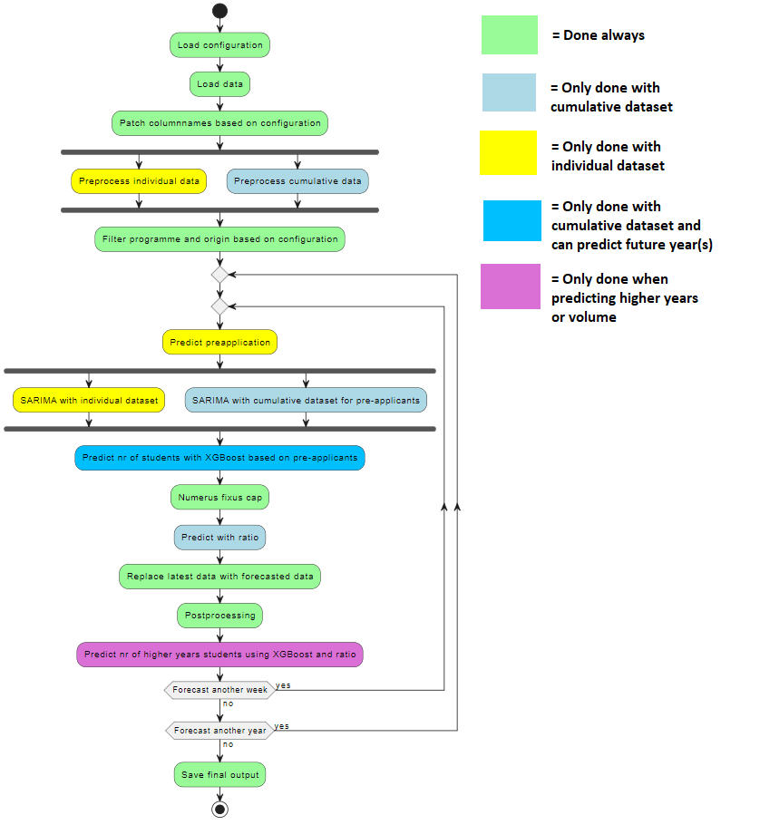
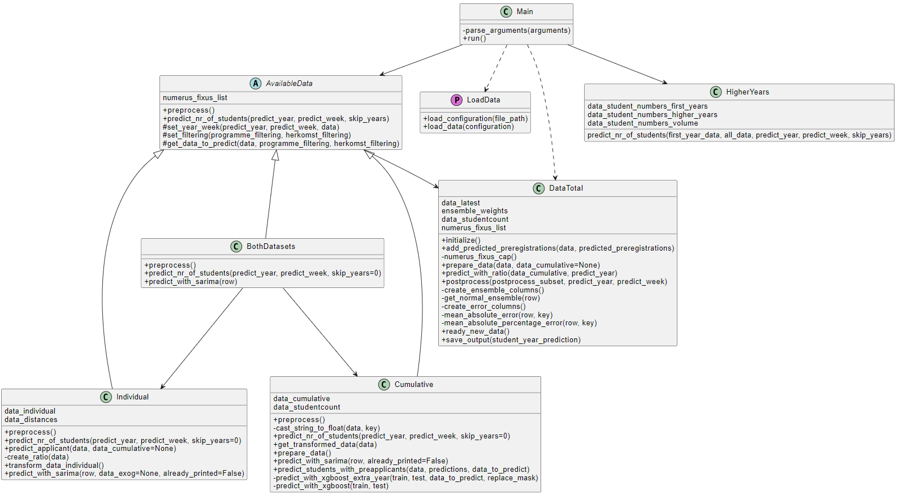
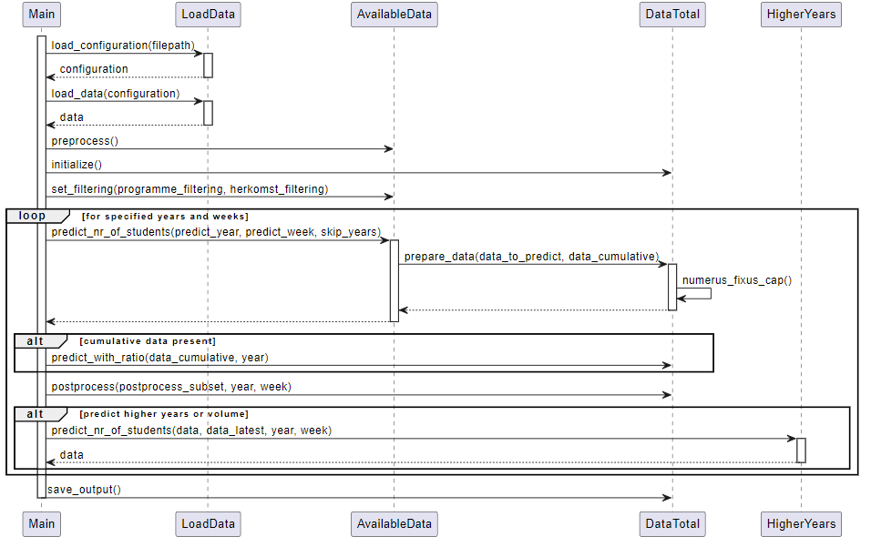

# Beste landelijke collega's

We zijn druk bezig het script te optimaliseren en te verfijnen. De bugs uit de vorige versie zijn nu weggehaald. Dit is - nagenoeg - de code die wij as-is hanteren. De code is verder aangevuld met documentatie en de README is hieronder verder geüpdatet. Ik heb het testbestand met gepseudonimiseerde data toegevoegd zodat daarmee getest kan worden. Let wel: het cumulatieve gedeelte kan alleen aangeroepen worden hiermee. 

Binnenkort (mochten we daar tijd voor kunnen maken) komen we met een betere omschrijving van het 'individuele' bestand. Wordt vervolgd!!!!!!! FEEDBACK IS WELKOM!!!!

# Student forecasting model

This Python script predicts the influx of students at the Radboud University for the current year and week. The year and week can also be specified.

# Installation

To get started, use the make file to install all pre-commit, pre-push files and dependencies and create a virtual environment. Please do this every time you are going to use the program. This ensures being up-to-date and the usage of the virtual environment.

```
make install
```

# Usage of program

Execute the script with the current year and week using the following command:

```
python main.py
```

To predict different years/weeks or in a different way, use any of the following command line parameters to your liking.

## Years and weeks specification

Execute the script with a specified year and week with `-y` and `-w`, e.g.:

```
python main.py -w 6 -y 2024
python main.py -W 1 2 3 -Y 2024
python main.py -year 2023 2024
python main.py -week 40 41
```

For predicting multiple years/weeks we also provide slicing, in the example the weeks 10 up to and including 20 will be predicted:

```
python main.py -w 10 : 20 -y 2023
```

## Datasets

The main datasets that are used in this script are the cumulative data per programme/origin/year/week and individual data per student. If one of these is not present then only the other dataset can be used.

```
python main.py -d individual
python main.py -D cumulative
python main.py -dataset both
```

## Configuration

The script has to have a configuration file for numerous different reason. The path to the configuration is `configuration/configuration.json` by default, but can be changed in the terminal:

```
python main.py -c path/to/configuration.json
python main.py -configuration longer/path/to/config.json
```

## Filtering

The script has to have a filtering file to define the programme and herkomst filtering. The path to the filtering is `configuration/filtering/base.json` by default, but can be changed in the terminal:

```
python main.py -f path/to/filtering.json
python main.py -filtering longer/path/to/filtering.json
```

## Student year prediction

By default only the first year students are predicted, while the script also supports prediction of higher years or volume predictions.

```
python main.py -sy first-years
python main.py -SY higher-years
python main.py -studentyear volume
```

## Predict a year ahead

When wanting to predict e.g. the academic year 2025/2026, but only having some amount of pre-applicants data from the academic year 2023/2024, it is possible to predict that academic year using the skip years feature. By default this value is equal to 0, because then no years are skipped.

```
python main.py -sk 1 -y 2025
python main.py -skipyears 2 -year 2026
```

## Syntax

In the following the syntax for all command line options is shown:

| Cmd setting             | Short notation | Large notation | Cmd option             | Short notation | Large notation |
|-------------------------|----------------|----------------|------------------------|----------------|----------------|
| Prediction years        | -y or -Y       | -year          | One or more years      | 1 2 3          | 1 : 3          |
| Prediction weeks        | -w or -W       | -week          | One or more weeks      | 10 11 12       | 10 : 12        |
| Dataset                 | -d or -D       | -dataset       | Only individual        | i              | individual     |
| Dataset                 | -d or -D       | -dataset       | Only cumulative        | c              | cumulative     |
| Dataset                 | -d or -D       | -dataset       | Both dataset           | b              | both           |
| Configuration           | -c or -C       | -configuration | Config file path (str) |                |                |
| Student year prediction | -sy or -SY     | -studentyear   | First years            | f              | first-years    |
| Student year prediction | -sy or -SY     | -studentyear   | Higher years           | h              | higher-years   |
| Student year prediction | -sy or -SY     | -studentyear   | Volume                 | v              | volume         |
| Skip years              | -sk or -SK     | -skipyears     | Skip years             | 1              | 1              |

## Large example

Example 1: Predict volume of the years 2023 and 2024, weeks 10 up to and including 20 and use both datasets

```
python main.py -y 2023 2024 -w 10 : 20 -d b -sy v
```

Example 2: Predict first years students of the academic year 2025/2026, week 5, use cumulative, only postprocess new predicted data

```
python main.py -y 2025 -w 5 -d b -sy f -sk 1
```

## Testing

There are currently 6 tests defined. A different test for both datasets, the cumulative dataset and the individual. For every dataset there is a fast and exhaustive test. The tests will automatically make sure that the right configuration is loaded. The tests can be ran by using the Makefile commands for simplicity.

Example: Running the exhaustive test for both datasets

```
make test-eb
```

Please look at the Makefile for the other commands.

# Pre-commit

Pre-commit hooks are essential tools for maintaining code quality and consistency. They run automatically before each commit, catching common issues early in the development process. By enforcing coding standards and style guides, pre-commit hooks ensure that the codebase is clean and consistent, making it easier to read, maintain, and collaborate on.

In this project, we use several pre-commit hooks to enhance code quality. The check-yaml hook checks for syntax errors in YAML files, preventing potential misconfigurations. The end-of-file-fixer ensures that files end with a newline character, meeting POSIX standards and avoiding file concatenation issues. The trailing-whitespace hook removes unnecessary whitespace, leading to cleaner commits. Finally, black automatically formats Python code, ensuring consistent style and readability.

These hooks are run automatically before every commit. When an error is detected, it will be 'repaired' automatically. Note that you have to stage and commit these changes again. Otherwise no commit was done.

Note: Committing via the terminal will reveal more information about the concerning pre-commit than committing via Github Desktop/VSCode Source Control.

# Pre-push

In the pre-push process, a unit test is executed to verify the final results of the program. This step ensures that all changes meet the expected outcomes before being pushed to the remote repository. By running these tests, we can catch potential errors or regressions early, maintaining the integrity and reliability of the codebase. This automated check provides an additional layer of assurance that new changes will not introduce unexpected issues, facilitating a smoother integration of new code.

Because this process takes some time (appr. 165 seconds), it is sometimes useful to bypass this process. To do this, you can add the `--no-verify` flag when pushing.

```
$ git push --no-verify
```

NOTE: Please only do this when necessary. NEVER do this when pushing to the main branch.

# Process of script

The following image depicts the process of the script when executed with available datasets.



# Class diagram & sequence diagram

The following images represent the class diagram and sequence diagram (of the main script).





# Description of input and output files

## Input

### individual

Every line in this dataset represents an individual (pre-)application. The data consists of a key, information about the (pre-)application and information about the (pre-)applicant. This data is used to predict the 'SARIMA_individual'. This is data obtained by an internal team.

### cumulative

Every line in this dataset represents the number of applications per programme, per 'Herkomst', per year and week and per 'Herinschrijving'/'Hogerejaars' value. This data is used to predict the 'SARIMA_cumulative'. This is data obtained by an internal team. This data is obtained via studielink.

### latest

For every programme, herkomst, year and week a line is written containing data about the applications, all the different predictions and error (MAE and MAPE) values. This data is mostly used for calculating volume and higher years predictions. This data is obtained via studielink.

### student_count_first-years

This data consists of the actual number of first year students per year for every programme per herkomst. This data includes first year bachelor, master and pre-master students. This data is used to obtain the training data with the student count per programme when calculating the SARIMA_cumulative. Besides that it is also used for ratio prediction. This data is obtained via studielink.

### student_count_higher-years

This data consists of the actual number of higher year students per year for every programme per herkomst. This data includes first year bachelor and master students. This data is used to calculate the number of higher year/volume students by ratio. This data is obtained via studielink.

### student_volume

This data consists of the actual number of first- and higher year students per year for every programme per herkomst. This data includes first year bachelor and master students. This data is used to calculate the number of higher year/volume students by ratio. This data is obtained via studielink.

### distances

This data consists of distances from residences in the Netherlands to the university. This data will be merged into individual data of NL students to add this to the data that is used for XGBoost for calculating SARIMA_individual. This data is obtained via studielink.

### weighted_ensemble

This data consists of the weights given for every model used for the ensemble prediction. This data is obtained via studielink.


## Output

### output_prelim.xlsx

Preliminary output consisting of all the predictions that are made in this execution of the script. This data will afterwards be added to one of the three complete output files defined below.

### output_first-years.xlsx

The complete output file consisting the predictions about first year students.

### output_higher-years.xlsx

The complete output file consisting the predictions about higher year students.

### output_volume.xlsx

The complete output file consisting the volume predictions.
